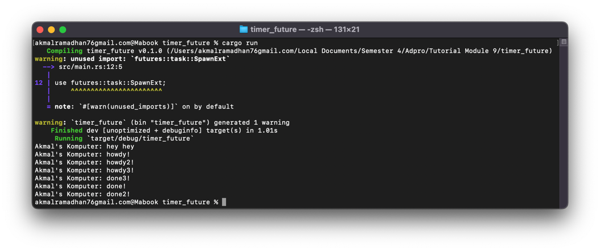

# Tutorial 9 - Advanced Programming - Timer
**Akmal Ramadhan - 2206081534 - Kelas A**

## Understanding How It Works

Walaupun `println!()` dijalankan setelah baris kode `spawner.spawn( async { ... });`, _string_ `hey hey` _printed_ sebelum _string_ `howdy!`. Mengapa? Karena fungsi `async` berjalan di luar eksekusi utama yang berarti program utama tidak menunggu fungsi `async` selesai sebelum melanjutkan eksekusi selanjutnya. Mencetak _string_ `hey hey` berada di luar fungsi `async` dan langsung dieksekusi oleh program utama sementara fungsi `async` menunggu hasil dari `future`. Sehingga, `hey hey` dicetak terlebih dahulu sebelum _task_ `async` dijalankan oleh `executor.`

## Multiple Spawn

**Multiple spawn:**

Perhatikan bahwa _string_ `done!` muncul kedua setelah _string_ `done2!` padahal di kode urutannya sebaliknya. Mengapa? Hal ini karena mereka berjalan secara _concurrently_. Ketiga _task_ dapat berjalan secara bersamaan tanpa menunggu satu sama lain sehingga tidak ada jaminan task akan selesai dalam urutan yang sama dengan urutan kode.

**Removing `drop(spawner);` statement:**

`drop(spawner)` perlu dilakukan untuk menandakan bahwa kita telah selesai menggunakan `spawner`. `spawner` berperilaku seperti _message queue_. Ketika kita _spawn_ sesuatu, sesuatu tersebut akan ditambahkan ke dalam antrian. Ketika `executor` jalan, pesan akan diambil dari antrian. Dengan `drop(spawner)` menunjukkan bahwa kita telah selesai mengirim pesan ke dalam antrian dan memungkinan `executor` untuk menyelesaikan tugas yang ada dan akhirnya mengakhiri program.